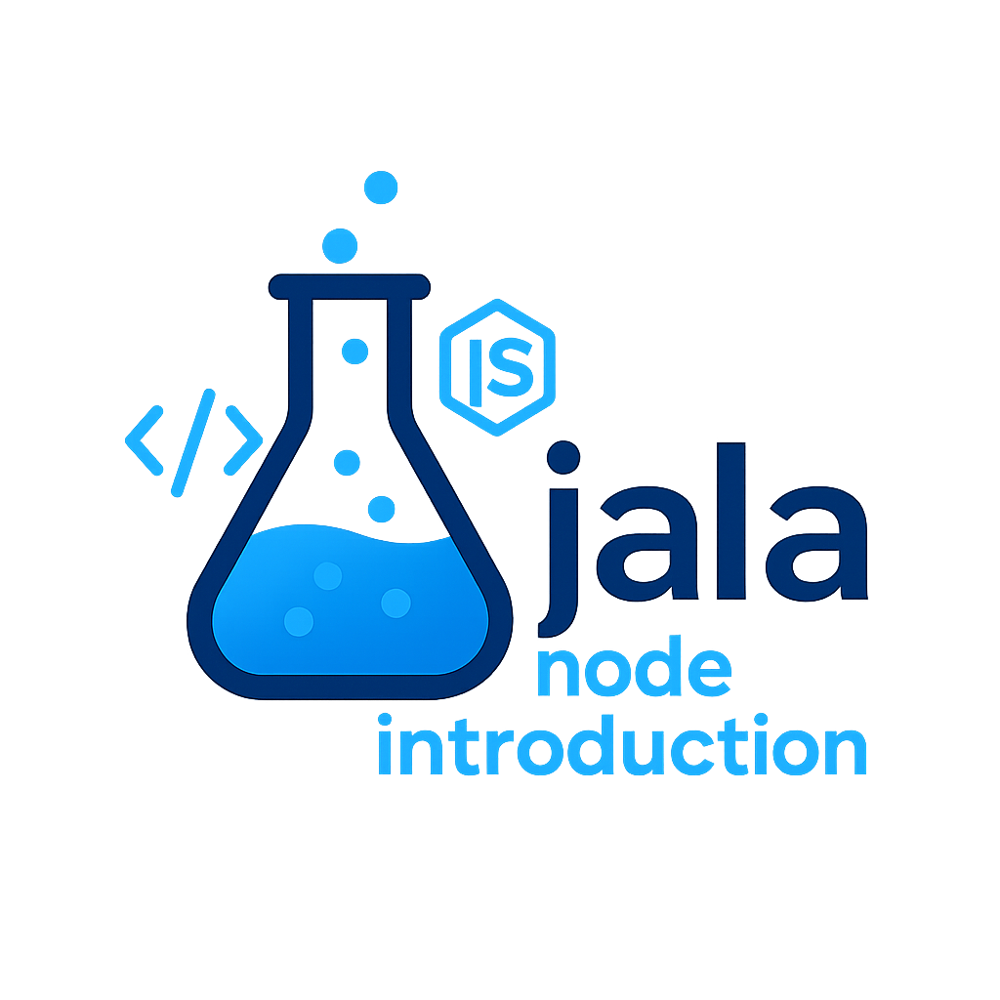
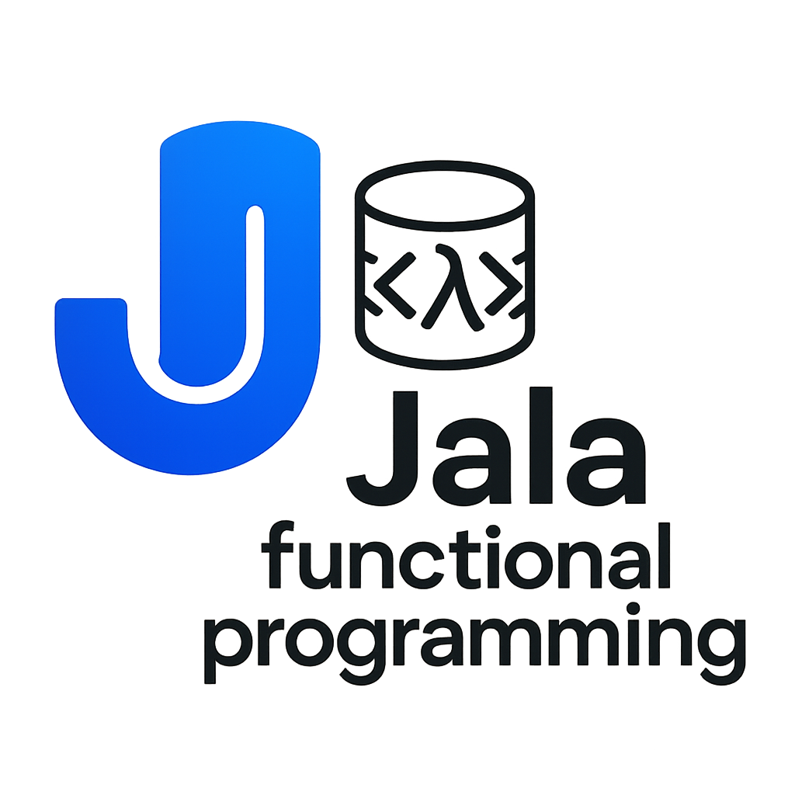
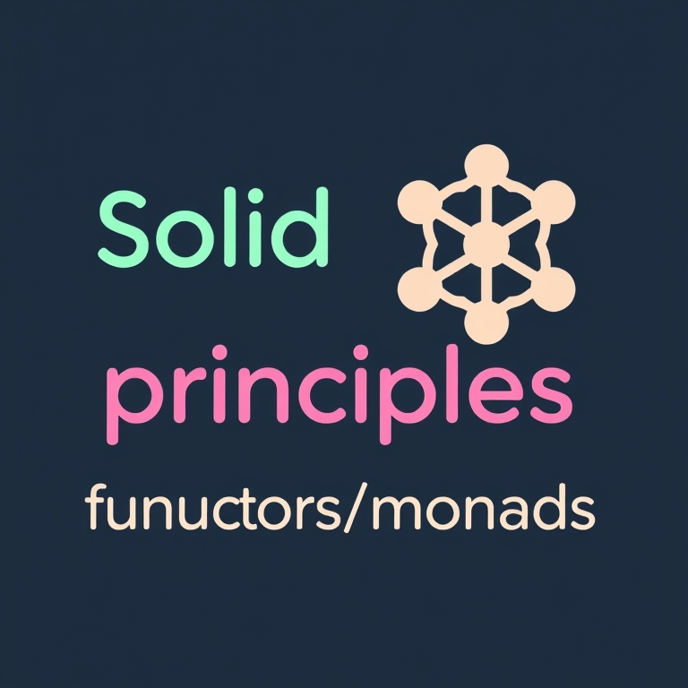
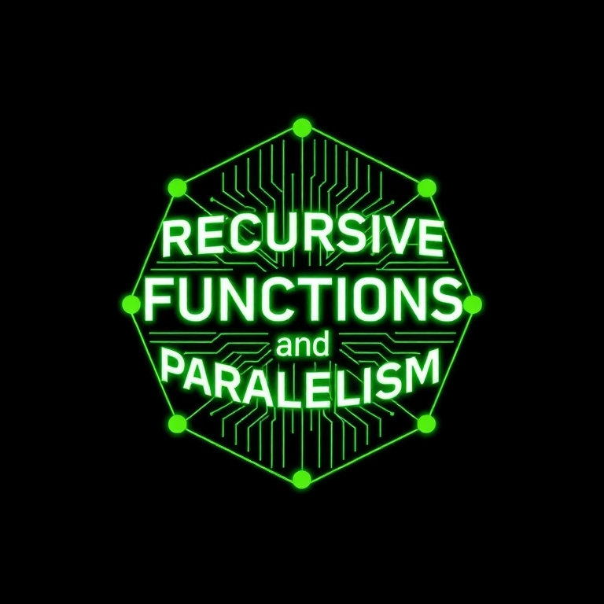
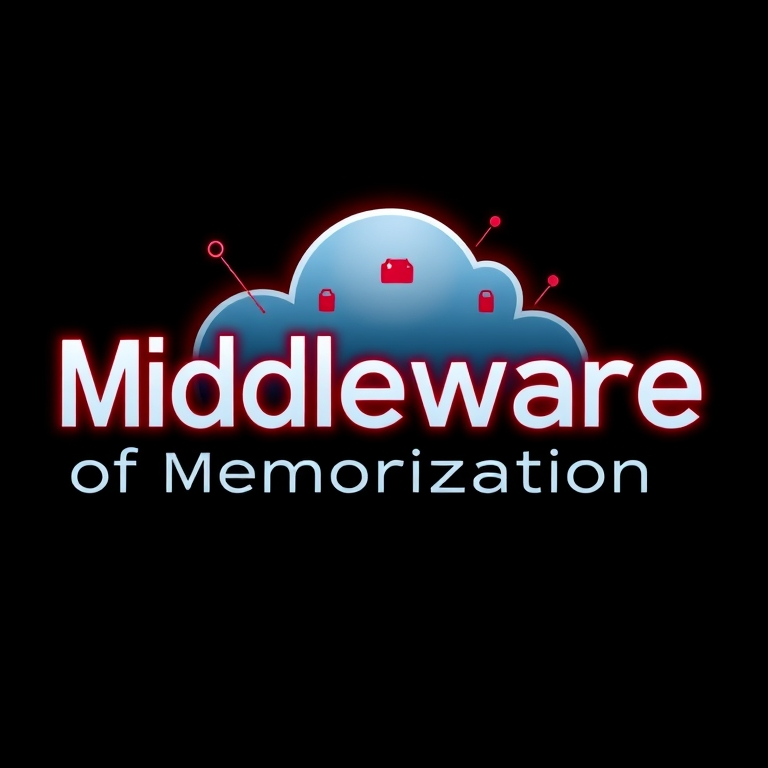

  
  <h2>
    Programing 4 Repository by Angel Gabriel Ortega
  </h2>

    
    
    
    

 
 

<h2>
🛠️ Objetive of the repository
</h2>

This repository is a combination of all the projects I have done during my studies in the **Programming 4** course at <a href="https://www.linkedin.com/school/jala-university">Jala University</a>.  
The main objective is to centralize all my Express.js + Node.js based projects, structured with best practices using JavaScript and Visual Studio Code.

The following table describes the order of the labs. Click any image to go to the README of each individual project to learn more about it:

 
 

<table align="center">

<tr>

<td width="25%" align="center">
  
  
</td>

<td width="25%" align="center">
  
  <a href="#">
     
</td>

<td width="25%" align="center">
  
  <a href="#">
     
</td>

<td width="25%" align="center">
  
  <a href="#">
     
</td>

</tr>

<tr>
<td width="25%" align="center">
  
  <a href="#">
     
</td>

<td width="25%" align="center">
  
  <a href="#">
     
</td>
<td width="25%" align="center">
  
  <a href="#">
     
</td>
</tr>

</table>

 
 

<h2>
🤝 Contributing
</h2>

Contributions are welcome! If you want to collaborate on improvements, feel free to fork the repository and submit a merge request.  
Before you contribute, please read our [contribution guidelines](/Contributing.md) to understand the process.

 
 

<h2>
📜 License
</h2>

This project is licensed under the MIT License. See the [LICENSE](/Licence.md) file for more details.

 
 

<h2>
🔧 Technologies Used
</h2>

  
  
  
  
  
  

