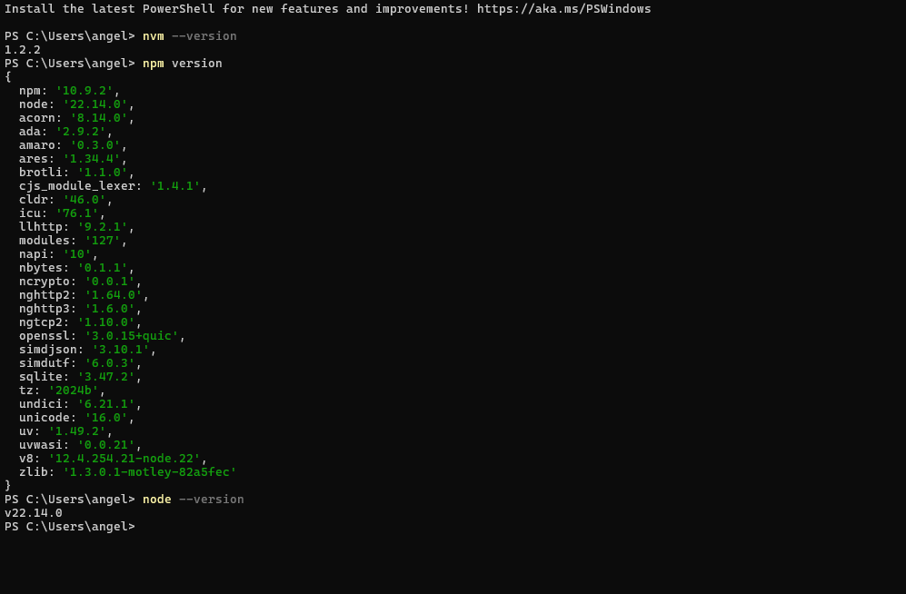
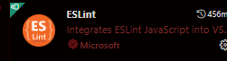
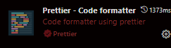
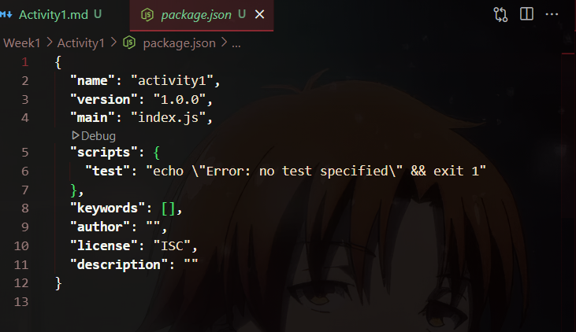
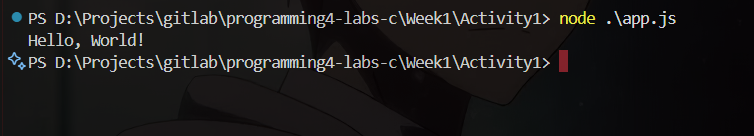

# Actividad 1 - Configuración del entorno de desarollo

El objetivo de esta actividad es configurar correctamente el entorno de desarrollo en Linux(Windows en mi caso) para el trabajo con Node.js y Visual Studio Code. Se busca familiarizarse con herramientas clave que se utilizarán a lo largo del curso. Como ejercicio final, se creará una aplicación sencilla en Node.js que imprime “Hello World” en la consola utilizando ES Modules.

---

## Requisitos

- Instalar Node.js y npm utilizando un manejador de versiones como `nvm`.
- Verificar múltiples versiones de Node.js instaladas y activas.
- Instalar Visual Studio Code en Linux.
- Instalar extensiones recomendadas: ESLint y Prettier.
- Crear un proyecto básico de Node.js con `npm init`.
- Aplicar buenas prácticas en la estructura y configuración del proyecto.
- Crear un script `app.js` que imprima "Hello World".
- Ejecutar el script usando Node.js y verificar su salida en la terminal.

---

## Descripción de la Implementación

### Instalación de Node.js y npm

Para instalar Node.js, se utilizó **nvm **. Esta herramienta permite administrar múltiples versiones de Node fácilmente.

```bash
curl -o- https://raw.githubusercontent.com/nvm-sh/nvm/v0.39.7/install.sh | bash
source ~/.bashrc
nvm install --lts
node -v
npm -v
nvm install 22 
nvm use 22
```




---

### Instalación de Visual Studio Code

Se descargó Visual Studio Code desde el sitio oficial. Posteriormente, se instalaron extensiones desde el Marketplace de VS Code.

- **Extensiones instaladas:**
  - ESLint
  - Prettier - Code formatter





---

### Creación del Proyecto en Node.js

Se creó una carpeta nueva para el proyecto. Desde la terminal integrada de VS Code, se ejecutó `npm init` para generar el archivo `package.json`.

```bash
npm init -y
```



#### Buenas prácticas aplicadas:
- Uso de nombres descriptivos para el proyecto.
- Inclusión de scripts útiles en `package.json` (por ejemplo: `"start": "node app.js"`).
- Separación del código en archivos independientes si el proyecto crece.
- Uso de formato ES Modules (`"type": "module"` en `package.json`).

---

### Creación del Script "Hello World"

Se creó un archivo llamado `app.js` dentro del proyecto. Contiene el siguiente código:

```js
console.log("Hello World");
```


---

### Ejecución del Script

Desde la terminal integrada de VS Code, se ejecutó el script con el comando:

```bash
node app.js
```

Esto imprimió correctamente el mensaje **"Hello World"** en la consola.



---

<div align="center">
<h2>
🛠️ Lo que aprendi
</h2>
</div>

Esta actividad me permitió sentar las bases para el desarrollo en Node.js, entendiendo el proceso de instalación, configuración y ejecución de scripts básicos. Además, aplique buenas prácticas como el uso de manejadores de versiones , la separación del código en archivos independientes y la utilización de formato ES Modules.
