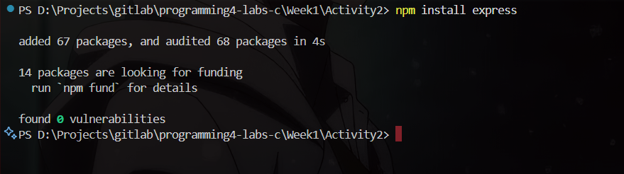
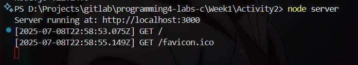
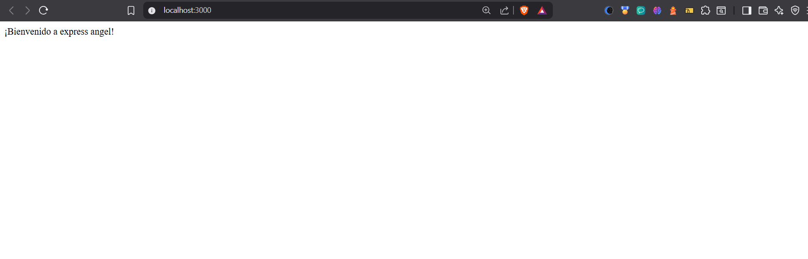

# Actividad 2- Mejores prácticas para desarrollar un servidor con Express.js
En esta actividad me propuse crear mi primer servidor con Node.js y Express.js. El objetivo era no solo instalar las dependencias necesarias, sino también organizar correctamente el proyecto aplicando buenas prácticas como el uso de rutas, controladores y middlewares.

---

## Configuración inicial del proyecto

Primero, creé una carpeta nueva para mi proyecto y la abrí en Visual Studio Code. Desde la terminal ejecuté:

```bash
npm init -y
```

Esto me generó el archivo `package.json` con la configuración base del proyecto. Después instalé Express:

```bash
npm install express
```


---

## estructura

Decidí organizar mi proyecto de la siguiente forma:

```
express-app/
│
├── app/
│   └── app.js
├── routes/
│   └── mainRoutes.js
├── controllers/
│   └── mainController.js
├── middlewares/
│   └── interceptor.js
├── package.json
├── server.js
```


### Por que?

Elegí esta estructura porque me ayuda a mantener el código limpio y separado por responsabilidad:

- `routes/` para las rutas.
- `controllers/` para la lógica que responde a cada ruta.
- `middlewares/` para funciones reutilizables que se ejecutan antes de las rutas.
- `server.js` como punto de entrada principal.

Esta organización será muy útil cuando el proyecto crezca en complejidad y toque depronto conectarlo con una base de datos, añadir funcionalidades de autenticación y demas.

---

## servidor

En el archivo `server.js` configuré el servidor Express. Aquí está el código:

```js
import http from 'http';
import express from 'express';
import mainRoutes from './routes/mainRoutes.js';
import interceptor from './middlewares/interceptor.js';

const app = express();
const port = process.env.PORT || 3000;
const server = http.createServer(app);

app.use(interceptor);

app.use('/', mainRoutes);

server.listen(port, () => {
  console.log(`Server running at: http://localhost:${port}`);
});

});
```

📌 Me aseguré de usar ES Modules agregando `"type": "module"` en el `package.json`.  
📌 También declaré el middleware *antes* de las rutas, como buena práctica.

---

##  rutas

Creé el archivo `routes/mainRoutes.js` con esta ruta simple:

```js
import express from 'express';
import { getHome } from '../controllers/mainController.js';

const router = express.Router();

router.get('/', getHome);

export default router;
```

📌 Me gustó usar `Router()` porque me permite modularizar todo y mantener ordenado el código.

---

## controlador

En el archivo `controllers/mainController.js` definí el controlador para la ruta principal:

```js
export const getHome = (req, res) => {
  res.send('¡Bienvenido a express angel!');
};
```


## Middleware personalizado

En `middlewares/logger.js` hice un middleware que me muestra información de cada solicitud:

```js
const logger = (req, res, next) => {
  console.log(`[${new Date().toISOString()}] ${req.method} ${req.url}`);
  next();
};

export default logger;
```


## Ejecutando el servidor

Ejecuté mi servidor con el siguiente comando:

```bash
node server
```



Después abrí el navegador y accedí a `http://localhost:3000` y vi el mensaje



---

<div align="center">
<h2>
🛠️ ¿Qué aprendí?
</h2>
</div>

Esta actividad me ayudó muchísimo a entender cómo se estructura un proyecto en Node.js usando Express. Pude ver lo importante que es tener el código bien separado, usar middlewares correctamente y cómo configurar un servidor desde cero. Es la base para crear APIs completas y profesionales más adelante.

---
