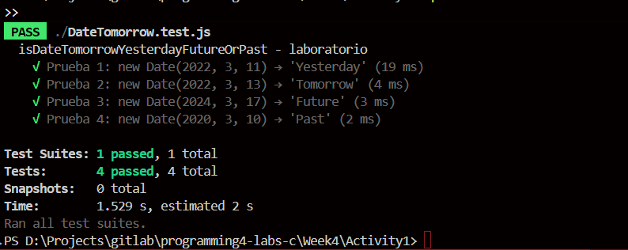

# Actividad #1

El objetivo de esta actividad fue implementar **pruebas automatizadas** usando **Jest** para validar el comportamiento de una función que determina la relación temporal entre una fecha dada y el día actual. Las pruebas cubren todos los casos posibles: ayer, mañana, futuro y pasado, asegurando la correcta funcionalidad del código mediante **testing unitario**.

---

## Requisitos

- Analizar la función `isDateTomorrowYesterdayFutureOrPast` y sus posibles casos de uso.
- Escribir pruebas automatizadas que cubran todos los escenarios posibles.
- Utilizar Jest para simular fechas específicas y validar los resultados esperados.
- Implementar las mejores prácticas de testing como `beforeEach` y `afterEach`.

---

## Descripción de la Implementación

### Función que probe: `isDateTomorrowYesterdayFutureOrPast`

Función que simplemente compara una fecha dada con la fecha actual y determina si corresponde a ayer, mañana, futuro o pasado.

```js
function isDateTomorrowYesterdayFutureOrPast(date) {
  const now = new Date();
  const today = now.getDate();
  const dateDay = date.getDate();

  if (dateDay - 1 === today) {
    return "Tomorrow";
  } else if (dateDay + 1 === today) {
    return "Yesterday";
  } else if (dateDay > today) {
    return "Future";
  } else {
    return "Past";
  }
}
```

### Pruebas con jest

comence haciendo el archivo `DateTomorrow.test.js` con la siguiente configuración y cubriendo cada caso solicitado por el laboratorio:

```js
const { isDateTomorrowYesterdayFutureOrPast } = require("./DateTomorrow");

describe("isDateTomorrowYesterdayFutureOrPast - laboratorio", () => {
  beforeEach(() => {
    jest.useFakeTimers().setSystemTime(new Date(2022, 3, 12));
  });

  afterEach(() => {
    jest.useRealTimers();
  });

  it("Prueba 1: new Date(2022, 3, 11) → 'Yesterday'", () => {
    const date = new Date(2022, 3, 11);
    expect(isDateTomorrowYesterdayFutureOrPast(date)).toBe("Yesterday");
  });

  it("Prueba 2: new Date(2022, 3, 13) → 'Tomorrow'", () => {
    const date = new Date(2022, 3, 13);
    expect(isDateTomorrowYesterdayFutureOrPast(date)).toBe("Tomorrow");
  });

  it("Prueba 3: new Date(2024, 3, 17) → 'Future'", () => {
    const date = new Date(2024, 3, 17);
    expect(isDateTomorrowYesterdayFutureOrPast(date)).toBe("Future");
  });

  it("Prueba 4: new Date(2020, 3, 10) → 'Past'", () => {
    const date = new Date(2020, 3, 10);
    expect(isDateTomorrowYesterdayFutureOrPast(date)).toBe("Past");
  });
});
```

### Casos de prueba implementados

**Configuración de fecha base:** Se estableció el 12 de abril de 2022 como fecha de referencia usando `jest.useFakeTimers()`.

**Prueba 1 - Yesterday:**
- Entrada: `new Date(2022, 3, 11)` (11 de abril de 2022)
- Resultado esperado: `"Yesterday"`
- Validación: Fecha anterior al día actual

**Prueba 2 - Tomorrow:**
- Entrada: `new Date(2022, 3, 13)` (13 de abril de 2022)  
- Resultado esperado: `"Tomorrow"`
- Validación: Fecha posterior al día actual (día siguiente)

**Prueba 3 - Future:**
- Entrada: `new Date(2024, 3, 17)` (17 de abril de 2024)
- Resultado esperado: `"Future"`
- Validación: Fecha muy posterior al día actual

**Prueba 4 - Past:**
- Entrada: `new Date(2020, 3, 10)` (10 de abril de 2020)
- Resultado esperado: `"Past"`
- Validación: Fecha muy anterior al día actual

---


### resultado o salida obtenida:




<div align="center">
<h2>
🛠️ Lo que aprendí
</h2>
</div>

Esta lab me ayudo a recordar bastante y el uso de **Jest** como framework de testing. Aprendí a utilizar `jest.useFakeTimers()` para simular fechas específicas, implementar `beforeEach` y `afterEach` para configurar y limpiar el entorno de pruebas, y validar el comportamiento de funciones que dependen del tiempo. Comprendí la importancia de cubrir todos los casos posibles para garantizar la robustez del código y las mejores prácticas del testing unitario.