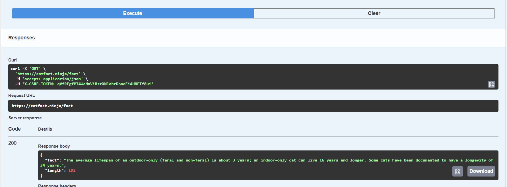
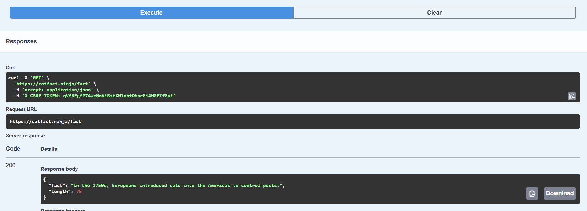
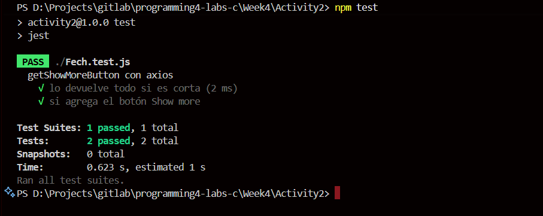

# Actividad #3 - API Testing: Pruebas automatizadas con Jest y Mocking

El objetivo de esta actividad fue implementar **pruebas automatizadas** usando **Jest** para validar el comportamiento de funciones que consumen APIs externas. La función analizada obtiene datos curiosos sobre gatos de la API **CatFact.ninja** y implementa lógica para truncar textos largos agregando un botón "Show more". Utilicé **mocking** para simular las respuestas de la API y probar diferentes escenarios sin depender de conexiones reales.

---

## Requisitos

- Probar una función que consume la API de CatFact.ninja para obtener datos sobre gatos.
- Validar que textos mayores a 100 caracteres se trunquen correctamente con "...Show more".
- Implementar mocking con Jest para simular respuestas de la API.
- Cubrir casos de prueba para textos cortos y largos.

---

## Descripción de la Implementación

### Funciones a probar

Funciones que consumen la API externa y procesan la respuesta según la longitud del contenido.

```js
async function getCatFacts() {
  const response = await fetch("https://catfact.ninja/fact");

  return await response.json();
}

async function getShowMoreButton() {
  const catFact = await getCatFacts();

  if (catFact.length > 100) {
    return catFact.fact.slice(0, 100).concat('...Show more');
  }

  return catFacts.fact;
}
```

### Suite de pruebas con mocking

Implementación completa de las pruebas automatizadas usando **axios** y **jest.mock()** para simular las respuestas de la API.

```js
const axios = require("axios");
const { getShowMoreButton } = require("./Fetch.js");

jest.mock("axios");

describe("getShowMoreButton con axios", () => {
  it("lo devuelve todo si es corta", async () => {
    const shortFact = "In the 1750s, Europeans introduced cats into the Americas to control pests.";
    axios.get.mockResolvedValueOnce({
      data: { fact: shortFact, length: shortFact.length },
    });

    const result = await getShowMoreButton();
    expect(result).toBe(shortFact);
  });

  it("si agrega el botón Show more", async () => {
    const longFact =
      "The average lifespan of an outdoor-only (feral and non-feral) is about 3 years; an indoor-only cat can live 16 years and longer. Some cats have been documented to have a longevity of 34 years.";
    axios.get.mockResolvedValueOnce({
      data: { fact: longFact, length: longFact.length },
    });

    const result = await getShowMoreButton();
    expect(result).toBe(longFact.slice(0, 100) + "...Show more");
  });
});
```

### Casos de prueba implementados

**Configuración del mock:** Se utilizó `jest.mock("axios")` para interceptar las llamadas HTTP y simular respuestas controladas.

**Prueba 1 - Texto corto:**
- **Entrada simulada:** `"In the 1750s, Europeans introduced cats into the Americas to control pests."`
- **Longitud:** 73 caracteres (menor a 100)
- **Resultado esperado:** Texto completo sin modificaciones
- **Validación:** Confirma que textos cortos se devuelven intactos

## evidencia




**Prueba 2 - Texto largo con truncamiento:**
- **Entrada simulada:** Texto de 186 caracteres sobre la longevidad de los gatos
- **Longitud:** 186 caracteres (mayor a 100)
- **Resultado esperado:** Primeros 100 caracteres + `"...Show more"`
- **Validación:** Confirma que textos largos se trunquen correctamente

## evidencia



### API 

**CatFact.ninja API:** https://catfact.ninja/fact
- Proporciona datos curiosos aleatorios sobre gatos
- Respuesta en formato JSON con campos `fact` y `length`


## resultados obtenidos de los casos de prueba



---

<div align="center">
<h2>
🛠️ Lo que aprendí
</h2>
</div>

Esta actividad me permitió profundizar en el **testing de APIs** y el uso de **mocking** con Jest. Aprendí a simular respuestas HTTP usando mocking, lo que me permite probar funciones asíncronas sin depender de servicios externos. Comprendí la importancia de probar diferentes escenarios (textos cortos y largos) para validar la lógica de truncamiento. También reforcé conceptos sobre **testing de funciones asíncronas** y las mejores prácticas para aislar componentes durante las pruebas unitarias.