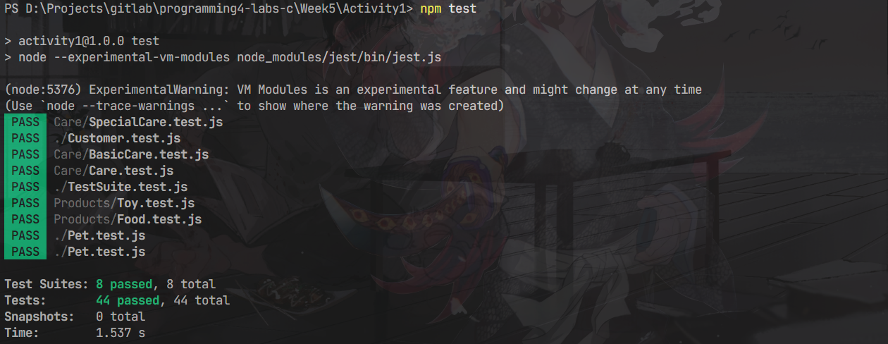

# Actividad #2 - Aplicando Functors o Monads a mi Proyecto Capstone

<div align="center">

## Mi experiencia implementando Monads en Path Finderx
### *Cómo la programación funcional transformó mi aplicación del mundo real*

</div>

Durante esta actividad, decidí implementar el patrón Monad en mi proyecto capstone para mejorar la forma en que manejo las operaciones encadenadas y gestiono los errores. Lo que logré fue sorprendente: mi código se volvió más limpio, fácil de mantener y mucho más robusto, especialmente cuando trabajo con operaciones complejas como la autenticación de usuarios.

---

## Lo que quería lograr

> **Mis objetivos principales fueron:**
> - **Encontrar** un caso de uso perfecto donde aplicar Functors o Monads
> - **Crear** una implementación sólida del concepto en mi capstone
> - **Validar** que todo funcionara correctamente
> - **Documentar** mi proceso y reflexionar sobre el impacto real

---

## El problema que decidí resolver

### Autenticación de Usuarios

> **El desafío: manejar una cadena de operaciones donde cualquier cosa puede fallar**

Cuando analicé mi código, me di cuenta de que el proceso de autenticación era perfecto para aplicar Monads. ¿Por qué? Porque involucra múltiples pasos secuenciales donde cada uno puede fallar:

1. Primero busco al usuario por su nombre de usuario
2. Verifico que realmente exista en mi base de datos
3. Me aseguro de que haya confirmado su correo electrónico
4. Valido que la contraseña sea correcta
5. Si todo sale bien, genero un token JWT

Lo interesante es que cada paso depende del éxito del anterior. Si algo falla en el camino, necesito detener todo el proceso y devolver un error específico. Antes de usar Monads, esto era un dolor de cabeza con try/catch anidados por todas partes.

---

## ¿Por qué elegí Monads?

### Mi razonamiento

Después de investigar y reflexionar, decidí implementar un **Monad** porque:

- **Operaciones encadenadas**: Necesitaba conectar múltiples operaciones donde cada una depende del resultado de la anterior
- **Efectos secundarios reales**: Mis operaciones incluyen consultas a la base de datos y validaciones complejas
- **Control de flujo inteligente**: Quería manejar éxitos y errores de manera elegante en cada paso
- **Composición asíncrona**: Necesitaba componer operaciones asíncronas sin volverme loco

Un Functor me habría permitido transformar valores (usando `map`), pero un Monad me da la superpotencia de encadenar operaciones que devuelven valores en el mismo contexto (usando `flatMap`). Eso era exactamente lo que necesitaba. Aunque igual como el profe dijo en clase, una monad al final es un functor con potencia adicional.

---

## Cómo lo implementé

### Mi clase Result

Creé mi propia clase `Result` como el corazón de mi implementación:

```javascript
export class Result {
  constructor(isSuccess, value, error) {
    this.isSuccess = isSuccess;
    this.value = value;
    this.error = error;
    Object.freeze(this); 
  }

  static ok(value) {
    return new Result(true, value, null);
  }

  static fail(error) {
    return new Result(false, null, error);
  }

  isOk() {
    return this.isSuccess;
  }

  isFail() {
    return !this.isSuccess;
  }

  map(fn) {
    return this.isOk() 
      ? Result.ok(fn(this.value)) 
      : Result.fail(this.error);
  }

  flatMap(fn) {
    return this.isOk() 
      ? fn(this.value) 
      : Result.fail(this.error);
  }

  fold(onSuccess, onFailure) {
    return this.isOk() 
      ? onSuccess(this.value) 
      : onFailure(this.error);
  }

  getOrElse(defaultValue) {
    return this.isOk() ? this.value : defaultValue;
  }
}
```

Me aseguré de que cumpliera con las leyes monádicas (sí, investigué esto porque quería hacerlo bien):

1. **Identidad izquierda**: `Result.ok(x).flatMap(f) === f(x)`
2. **Identidad derecha**: `m.flatMap(Result.ok) === m`
3. **Asociatividad**: `m.flatMap(f).flatMap(g) === m.flatMap(x => f(x).flatMap(g))`

### Cómo transformé mi AuthService

Así quedó mi método `login` usando mi nuevo Monad:

```javascript
async login(requestBody) {
  const loginRequest = new AuthLoginRequest(requestBody);
  const { username, password } = loginRequest;

  const user = await this.userService.findByUsername(username);
  if (!user) {
    return Result.fail(
      new AuthResponse({
        username: null,
        message: 'User not found',
        jwt: null,
        status: false,
      })
    );
  }

  const interceptorResult = await safeAsync(() =>
    runInterceptors([() => validateConfirmedMail(user)])
  );

  if (interceptorResult.isFail()) {
    return Result.fail(
      new AuthResponse({
        username: null,
        message: interceptorResult.error.message,
        jwt: null,
        status: false,
      })
    );
  }

  const isValidPassword = await bcrypt.compare(password, user.password);
  if (!isValidPassword) {
    return Result.fail(
      new AuthResponse({
        username: null,
        message: 'Incorrect password',
        jwt: null,
        status: false,
      })
    );
  }

  const token = generateToken(user);

  return Result.ok(
    new AuthResponse({
      username: user.username,
      message: 'User logged in successfully',
      jwt: token,
      status: true,
    })
  );
}
```

---

## Lo que gané con esta implementación

### Los beneficios reales que experimenté

1. **Código más claro**: Ahora puedo leer mi código como una historia - paso 1, luego paso 2, etc.
2. **Errores que se manejan solos**: Si algo falla en cualquier punto, automáticamente se propaga hasta el final
3. **Adiós a los try/catch anidados**: Ya no tengo bloques try/catch en cada esquina de mi código
4. **Modularidad real**: Cada operación es independiente y puedo probarla por separado
5. **Composición elegante**: Puedo combinar operaciones complejas de manera natural
6. **Mantenimiento más fácil**: Agregar o cambiar pasos ya no es una pesadilla

### Comparando con mi código anterior

Antes de usar Monads, mi método `login` se veía así (y era horrible):

```javascript
async login(requestBody) {
  try {
    const loginRequest = new AuthLoginRequest(requestBody);
    const { username, password } = loginRequest;

    const user = await this.userService.findByUsername(username);
    if (!user) {
      throw new Error('Usuario no encontrado');
    }

    try {
      await runInterceptors([() => validateConfirmedMail(user)]);
    } catch (error) {
      throw error;
    }

    const isValidPassword = await bcrypt.compare(password, user.password);
    if (!isValidPassword) {
      throw new Error('Contraseña incorrecta');
    }

    const token = generateToken(user);
    return new AuthResponse.success(user.username, token);
  } catch (error) {
    return AuthResponse.failure(error.message);
  }
}
```
Luego cree unos test sencillos para probar la funcionalidad del nuevo login y quedaron esplendidos:




---

## Mis reflexiones finales

Implementar el patrón Monad en mi proyecto capstone fue una de las mejores decisiones que tomé. Al principio me intimidaba un poco  la programación funcional puede parecer abstracta cuando vienes del mundo imperativo. Pero una vez que "hice click" con el concepto, todo cambió. Mi código de autenticación ahora es limpio, fácil de entender y, lo más importante, fácil de modificar. Cuando mi profesor o compañeros revisan mi código, pueden seguir el flujo sin perderse en un mar de try/catch. Lo que más me sorprendió fue darme cuenta de que los Monads no son solo teoría académica  son herramientas prácticas que resuelven problemas reales. Ahora estoy pensando en aplicar este patrón en otras partes de mi proyecto donde tengo operaciones encadenadas similares. Lo malo? Me toca invertir mas tiempo en la refactorización de código que tengo que hacer pero me gusta como va tomando forma mi hibrido de imperativo, funcional y orientado a objetos.